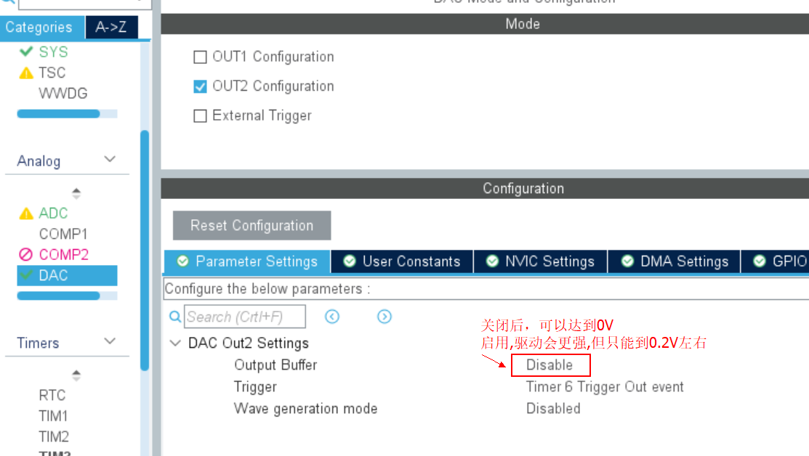
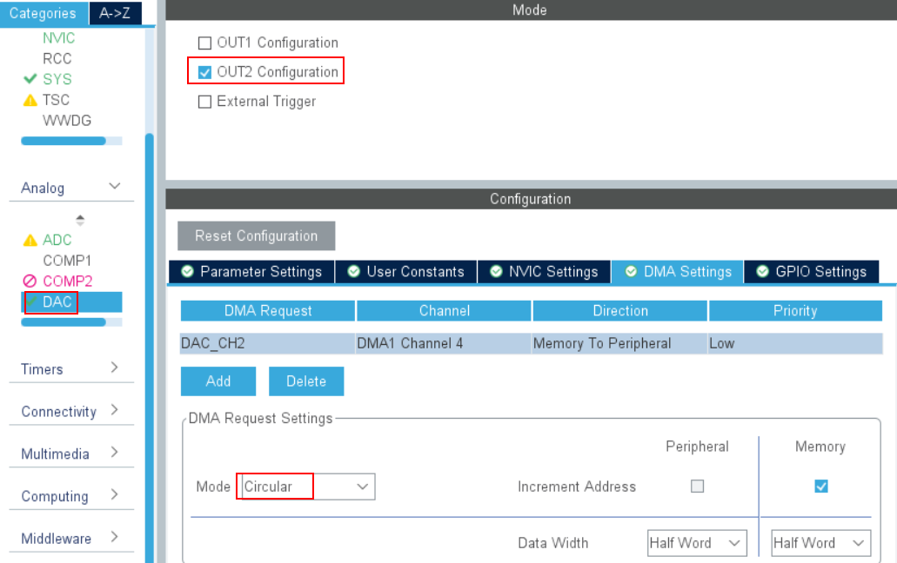
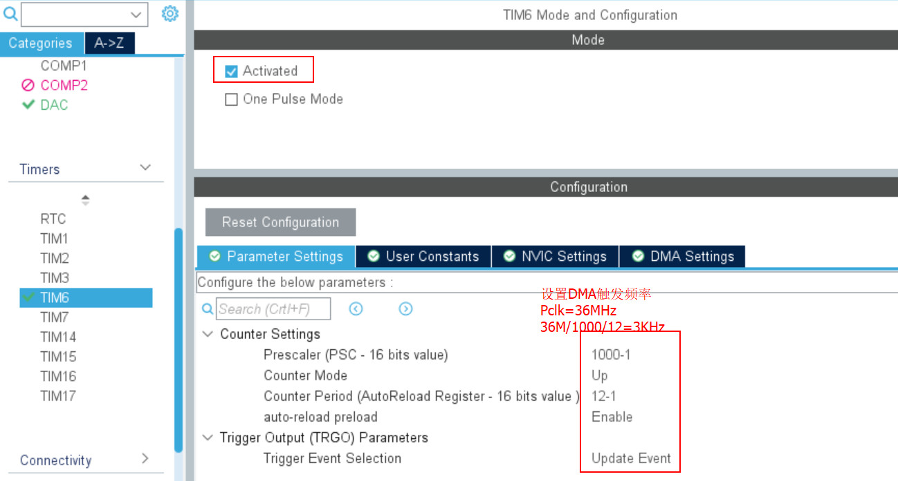
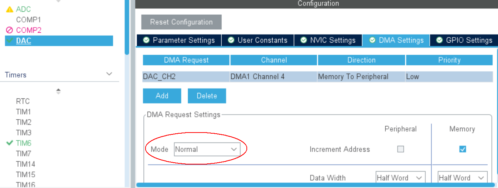

# DAC＋DMA＋TIM 播放语音
> stm32F091RC
---
1. 设置DAC
   
2. 设置DMA
   
3. 设置定时器
   
4. 生成正弦波数据
 ```
 /* num:一个正弦波中采集的点数
 * p:存放数据的数组
 * U:输出电压的峰值(0~1.5V)
 */
#include "math.h"
#define PI (double)3.1415927
void SinWaveData(uint16_t num,uint16_t *p,float U)
{	
	uint16_t i;
	for(i=0;i<num;i++)
		*p++ = (uint16_t)((U * sin(( 1.0*i/(num-1))*2*PI)+U)*4095/3.3);
		//D[i] = (u16)((U*sin(( 1.0*i/(num-1))*2*Pi)+U)*4095/3.3);
}
```
5. 启动DAC
```
    SinWaveData(100,DualSine12bit,1.5);
	HAL_TIM_Base_Start(&htim6);
	HAL_DAC_Start_DMA(&hdac,DAC1_CHANNEL_2,(uint32_t *)DualSine12bit,100,DAC_ALIGN_12B_R);
  
```
6. 播放语音
   - 播放语音，需要把DMA设成normal,如图
     
   - 生成数据,用工具“tools/wav2Header.exe”,把wave文件转成头文件
   - 测试过的wave文件8k/16bit,32k/16bit
   - 按照wave的格式修改TIM6的定时：//500/12:8K  250/12:16K 125/12:32K 125/6:64K 125/3:128K
   - HAL_DAC_Start_DMA(&hdac,DAC1_CHANNEL_2,(uint32_t *)audio_dat,sizeof(audio_dat)/2,DAC_ALIGN_12B_R);
